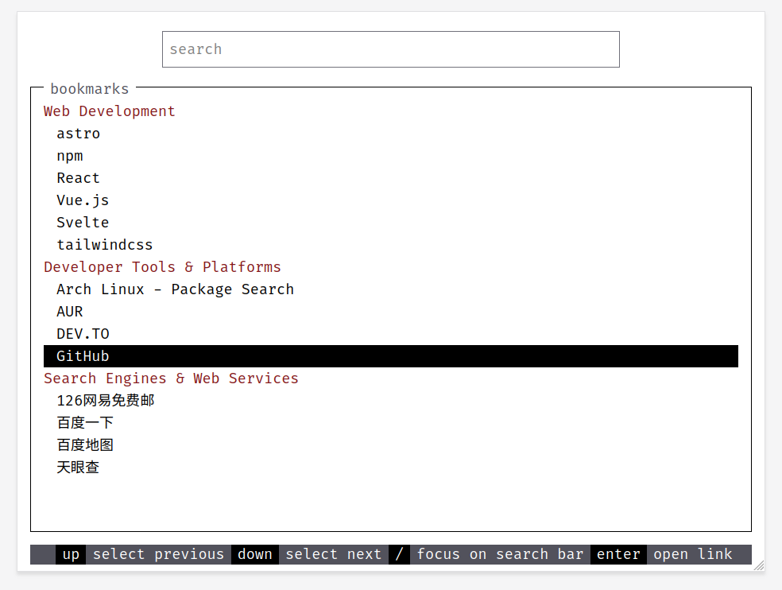

# Startpage

A minimalistic browser startpage with terminal-style interface, featuring keyboard navigation and customizable bookmarks.



## Features

- **Terminal UI Aesthetics**
- **Keyboard Navigation**
  - Arrow keys for navigation
  - `Enter` to open selected link
  - `/` to focus on the filter bar
- **Customizable Content**
  - JSON-configurable bookmark categories
- **Stack**
  - Built with Astro + Svelte
  - Styled with Tailwind CSS

## Installation

1. Clone the repository:
   ```bash
   git clone https://github.com/chenxing-dev/startpage.git
   cd startpage
   ```

2. Install dependencies:
   ```bash
   npm install
   ```

3. Configure your bookmarks:
   Edit `src/data/bookmarks.json` with your preferred categories and links.

## Usage

### Development
```bash
npm run dev
```

### Build for Production
```bash
npm run build
```

## Configuration

Modify `src/data/bookmarks.json` to customize your links:
```json
{
  "categories": [
    {
      "name": "Category Name",
      "links": [
        {"name": "Link Title", "url": "https://example.com"}
      ]
    }
  ]
}
```

## Deployment

### Github Pages

Enable GitHub Pages. https://github.com/chenxing-dev/startpage/settings/pages

The `deploy.yml` workflow is triggered every time you push to the `main` branch and deploy to Github Pages

## TODOs

- [ ] Add light/dark theme toggle
- [ ] Implement localStorage for user-customized bookmarks

## License

MIT © [陈刑](https://github.com/chenxing-dev)
